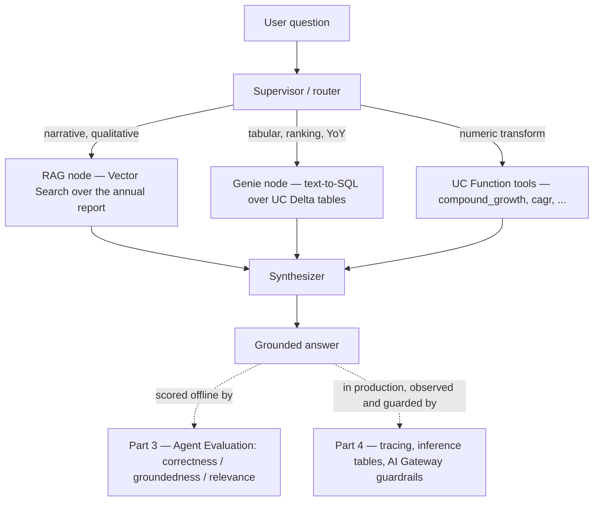

# AGENTIC AI & LLMOPS
## CS 4603 · EXTRA-CREDIT ASSIGNMENT 1
---
### Governed Tools, Structured Retrieval, Evaluation & Operations — building on PA4
### LUMS SBASSE · Summer 2026

---

## What this assignment is

PA4 gave you a **working, deployed** multi-agent Document Analyst. It runs, but it skips the things that separate a demo from a production system: **governed tools**, **structured-data retrieval**, **measured quality**, and **production observability & governance**. This extra-credit assignment closes those gaps across **four parts** (the fourth is optional) that build on your existing PA4 project.

| Part | Theme | You will… | Spec |
|------|-------|-----------|------|
| **Part 1** | **Governed tools** | Re-implement your PA4 math/finance tools as **Unity Catalog Functions** (discoverable, permissioned, versioned) and wire them in via `UCFunctionToolkit`, replacing the MCP tool node. | [parts/part-1-unity-catalog-tools.md](parts/part-1-unity-catalog-tools.md) |
| **Part 2** | **Structured retrieval** | Add an **AI/BI Genie** node that does **natural-language-to-SQL** over governed Delta tables, and let a **supervisor** route tabular questions to Genie and narrative questions to RAG. | [parts/part-2-genie-structured-data.md](parts/part-2-genie-structured-data.md) |
| **Part 3** | **Evaluation** | Build an **evaluation harness** with MLflow / Agent Evaluation, score the agent with LLM judges (correctness, groundedness, relevance), diagnose a failure, fix it, and **prove the improvement with numbers**. | [parts/part-3-agent-evaluation.md](parts/part-3-agent-evaluation.md) |
| **Part 4** *(bonus)* | **Observability & governance** | Optional production challenges: **tracing & inference tables**, **AI Gateway guardrails**, and a **prompt lifecycle** stretch — each with background and a mini-tutorial. | [parts/part-4-bonus-challenges.md](parts/part-4-bonus-challenges.md) |

The engineering theme: **you cannot govern, extend, or improve what you cannot measure, route, or observe.**

> This is extra credit. It **builds on your PA4 submission** — you reuse the same graph, the Meridian corpus, the Vector Search index, and (ideally) your deployed endpoint. If your PA4 is incomplete, a reference PA4 skeleton is acceptable as a starting point (state this in your write-up). Parts are largely independent — you may attempt any subset — but they are most rewarding done in order.

---

## How the pieces fit together



- **Part 1** governs the **T** (tools) node.
- **Part 2** adds the **G** (Genie) node and the routing that chooses between **R**, **G**, and **T**.
- **Part 3** wraps the whole graph in **E** (evaluation).
- **Part 4** *(optional)* wraps the deployed endpoint in **observability** (tracing, inference tables) and **governance** (gateway guardrails), plus a prompt-lifecycle stretch.

---

## Learning Outcomes

By the end you should be able to:

- Register **Python and SQL functions in Unity Catalog** and call them as governed, reusable tools via `UCFunctionToolkit`; grant/audit `EXECUTE` and reason about lineage.
- Redeploy an agent with **automatic authorization** for UC resources (`resources=[DatabricksFunction(...)]`, `DatabricksGenieSpace(...)`).
- Model **structured Delta tables** and curate a **Genie Space** so **natural-language-to-SQL** is reliable.
- Add Genie as a **routed node** in a multi-agent graph and reason about **structured (Genie) vs unstructured (RAG)** retrieval.
- Construct an **evaluation dataset**, run **LLM-as-judge** evaluation (`mlflow.evaluate` / Agent Evaluation), diagnose a failure mode, and **quantify** the effect of a fix.
- *(Part 4, optional)* Make a live query **observable** with MLflow Tracing and **inference tables**, enforce **guardrails** (AI Gateway or a code-level fallback), and **version prompts** with the MLflow Prompt Registry + aliases.

---

## Prerequisites

- A **completed (or near-complete) PA4** — the LangGraph graph, the Meridian Vector Search index, and ideally a deployed serving endpoint.
- Comfort with Unity Catalog basics (catalogs, schemas, `GRANT`), Databricks SQL, and MLflow logging from PA1–PA4.
- Packages (add to your PA4 env):

```bash
pip install databricks-langchain unitycatalog-ai unitycatalog-langchain databricks-agents databricks-sdk mlflow>=2.16
```

> Parts 1–3 work with the base install above. **Part 4** additionally uses `databricks-sdk` (Genie/Gateway, already included) and — for the prompt-lifecycle stretch — a **recent MLflow (3.x)** for `mlflow.genai.register_prompt`. On **Databricks Free Edition**, serving endpoints and AI Gateway are quota-limited; Part 4 provides code-level fallbacks so you're never blocked.

**Reference material**
- **Background tutorial (read first):** [`tutorials/uc-function-tools.md`](tutorials/uc-function-tools.md) — Unity Catalog Functions as governed agent tools (you already know `@tool` and MCP tools; this covers the third approach).
- PA4: `README.md` (spec), `tools/mcp_server.py` (the tools you will port), `deployment/` (logging + deploy pattern).
- Course repo `databricks_deployment_v2/` — the `agents.deploy()` + `resources=` automatic-auth pattern you extend to UC Functions and Genie.
- Databricks docs: *Unity Catalog functions as agent tools*, *AI/BI Genie & the Genie Conversation API*, *Agent Evaluation / `mlflow.evaluate`*.

---

## Suggested Directory Structure

Start from a copy of your PA4 project. New/changed files for this assignment:

```
ExtraCreditAssignment-1/
├── README.md                        # this overview
├── parts/
│   ├── part-1-unity-catalog-tools.md    # Part 1 spec — UC Functions as governed tools
│   ├── part-2-genie-structured-data.md  # Part 2 spec — Genie / text-to-SQL multi-agent
│   ├── part-3-agent-evaluation.md       # Part 3 spec — MLflow / Agent Evaluation
│   └── part-4-bonus-challenges.md       # Part 4 spec — bonus: tracing, guardrails, prompt lifecycle
├── tutorials/
│   └── uc-function-tools.md         # [GIVEN] — Unity Catalog Functions as governed tools
│
├── writeup.md                       # [STUDENT] — analysis answers for all parts
├── extra_credit.ipynb               # [STUDENT] — development & results notebook (all outputs visible)
│
├── uc_tools/                        # Part 1
│   ├── register_functions.py        # [STUDENT] — creates the UC Python/SQL functions
│   └── functions.sql                # [STUDENT] — SQL-defined function(s), for reference
│
├── genie/                           # Part 2
│   ├── build_tables.py              # [STUDENT] — create structured Delta tables in UC
│   ├── tables.sql                   # [STUDENT] — table DDL + column comments + trusted queries
│   └── genie_client.py              # [STUDENT] — query Genie via Conversation API / GenieAgent
│
├── agent/
│   ├── graph_uc.py                  # [STUDENT] — Part 1: PA4 graph with MCP node -> UCFunctionToolkit
│   └── graph_multi.py               # [STUDENT] — Part 2: adds the Genie node + routing
│
├── deployment/
│   └── deploy.py                    # [STUDENT] — redeploy with resources=[DatabricksFunction, DatabricksGenieSpace]
│
├── eval/                            # Part 3
│   ├── eval_dataset.jsonl           # [STUDENT] — evaluation questions + expected answers
│   ├── run_eval.py                  # [STUDENT] — mlflow.evaluate harness
│   └── results/                     # [STUDENT] — exported metrics / screenshots
│
└── bonus/                           # Part 4 (optional)
    ├── trace_and_monitor.py         # [STUDENT] — tracing + inference-table SQL (Challenge D)
    ├── guardrails.py                # [STUDENT] — code-level guardrail fallback if AI Gateway is unavailable (Challenge E)
    └── prompts.py                   # [STUDENT] — register / promote prompts via MLflow aliases (Challenge F)
```

---

## Submission

Submit a single zip named `<roll_number>_extra_credit_1.zip` containing:

- All source (`uc_tools/`, `genie/`, `agent/`, `deployment/`, `eval/`, and `bonus/` if you attempted Part 4)
- `extra_credit.ipynb` with **all outputs visible** (function registration, the UC-tool query, the Genie text-to-SQL round-trip and routing, the eval metrics, the before/after delta — and, if attempted, the Part 4 traces / guardrail evidence / prompt versions)
- `writeup.md` with every **Analysis** question (from all attempted parts) answered
- Do **not** include `.env`, virtual environments, or model binaries
- If you attempted only some parts, say so at the top of `writeup.md`.

---

## Reference Map

| Topic | Course material / docs |
|-------|------------------------|
| The agent you're extending | PA4 `README.md`, `agent/graph.py`, `tools/mcp_server.py` |
| `agents.deploy()` + `resources=` auto-auth | `databricks_deployment_v2/` |
| UC Functions as tools | Databricks docs: *Unity Catalog functions as AI agent tools* (`databricks-langchain` `UCFunctionToolkit`) |
| Genie / text-to-SQL | Databricks docs: *AI/BI Genie*, *Genie Conversation API*, `databricks_langchain.genie.GenieAgent`, `mlflow.models.resources.DatabricksGenieSpace` |
| Agent Evaluation / judges | Databricks docs: *Agent Evaluation*, `mlflow.evaluate(model_type="databricks-agent")` |
| Tracing & inference tables (Part 4) | Databricks docs: *MLflow Tracing*, *inference tables for Model Serving*, *agent/production monitoring* |
| AI Gateway guardrails (Part 4) | Databricks docs: *Mosaic AI Gateway* — note: limited on Free Edition; Part 4 includes a code-level fallback |
| Prompt lifecycle (Part 4) | Databricks/MLflow docs: *MLflow Prompt Registry* — `mlflow.genai.register_prompt` / `set_prompt_alias` / `load_prompt` |
