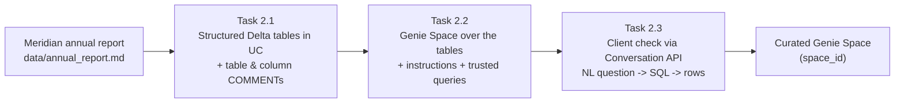
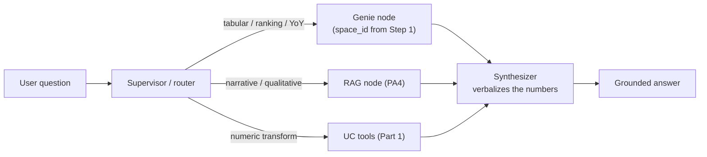

# Extra-Credit 1 · PART 2

## Genie: Structured-Data Retrieval in a Multi-Agent System

> Part of **CS 4603 Extra-Credit Assignment 1**.
> ← Prev: [Part 1 — UC Function tools](part-1-unity-catalog-tools.md) · Next: [Part 3 — Agent Evaluation](part-3-agent-evaluation.md) · [Overview](../README.md)

---

### Why this part exists

PA4's agent answers questions by **retrieving unstructured text** (Vector Search over the annual report). But a lot of "document analyst" questions are really **table questions** — *"Which business segment had the highest revenue in FY2023?"*, *"Rank the segments by operating margin."* Answering those from prose chunks is fragile: the model has to find the right sentences, read a table rendered as text, and do arithmetic in its head.

The Databricks-native answer is **AI/BI Genie**: you point Genie at governed **structured tables** in Unity Catalog and it does **natural-language-to-SQL** over them. In a multi-agent system, Genie becomes a *second retrieval tool* — a structured-data specialist that sits beside your RAG node, with a **supervisor** deciding which one a question needs.

> **Cert alignment.** This part maps to *"Enable multi-agent systems to leverage Genie Spaces or the conversational API to retrieve data"* and to the **Multiagent Supervisor** pattern in the GenAI Engineer Associate outline. It contrasts **unstructured RAG** with **structured text-to-SQL** retrieval.

By the end of this part you should be able to:
- Model a small **structured schema** in Unity Catalog Delta tables from source financials.
- Create and **curate** a Genie Space (table comments, instructions, trusted example queries) so text-to-SQL is reliable.
- Call Genie **programmatically** via the Conversation API / `GenieAgent`.
- Add Genie as a **routed node** in your LangGraph multi-agent graph, and reason about **when to route to RAG vs. Genie**.
- Deploy an agent that calls a Genie Space with **automatic authorization** (`DatabricksGenieSpace` resource).

---

### How this part works (build order)

You are adding a **second retrieval path** to your PA4 agent. Build it bottom-up: first the data, then the Genie Space over it, then wire it into the graph, then deploy.

**Step 1 — Set up the Genie Space (Tasks 2.1 → 2.2 → 2.3).** Do this once, offline:



Each box feeds the next: the report gives you numbers → the tables give Genie something to query → curation makes its text-to-SQL reliable → the client check proves it works headlessly. The output is a **`space_id`** for a Genie Space you trust.

**Step 2 — Use that Space as a node in the agent (Tasks 2.4 → 2.5).** The entire Step 1 result is now just **one box** ("Genie node"):



Task 2.4 adds the Genie node and teaches the **supervisor** to route to it; Task 2.5 redeploys with a `DatabricksGenieSpace` resource so the served endpoint calls Genie with automatic short-lived credentials (no PAT in code).

The key idea: **RAG reads prose; Genie reads tables.** The supervisor's only new job is deciding which one a question needs.

---

### Task 2.1: Build the structured tables

Turn the Meridian corpus into **governed Delta tables** in your UC schema — the numbers Genie will query. Create **at least two** tables, for example:

- `main.default.meridian_segment_financials` — one row per (fiscal_year, segment) with `revenue_yen`, `operating_income_yen`, `units_sold`.
- `main.default.meridian_income_statement` — one row per (fiscal_year, line_item) with `amount_yen`.

```python
# Expected pattern (derive the rows from data/annual_report.md, then write Delta):
import pandas as pd

segments = pd.DataFrame([
    {"fiscal_year": 2023, "segment": "Automobile",             "revenue_yen": 12_900_000_000_000, "operating_income_yen": 560_000_000_000, "units_sold":  4_070_000},
    {"fiscal_year": 2023, "segment": "Motorcycle",             "revenue_yen":  2_510_000_000_000, "operating_income_yen": 360_000_000_000, "units_sold": 18_500_000},
    {"fiscal_year": 2023, "segment": "Financial Services",     "revenue_yen":  1_100_000_000_000, "operating_income_yen": 180_000_000_000, "units_sold": None},
    {"fiscal_year": 2023, "segment": "Power Products & Other", "revenue_yen":    400_000_000_000, "operating_income_yen":  24_000_000_000, "units_sold": None},
    # ...add FY2022 rows so year-over-year questions work
])
spark.createDataFrame(segments).write.mode("overwrite").saveAsTable("main.default.meridian_segment_financials")
```

Requirements:
- Values must be **consistent with your annual report** (the totals should reconcile with the ¥16.91T net-revenue / ¥1.11T net-income figures your RAG agent already cites). Document how you derived each number.
- Add a **`COMMENT`** to every table and every column (`ALTER TABLE ... ALTER COLUMN ... COMMENT ...` or set them at create time). Genie relies heavily on these descriptions.
- Include **at least two fiscal years** so year-over-year and ranking questions are answerable.

> If you only have FY2023 narrative numbers, you may synthesize plausible prior-year figures — just say so and keep them internally consistent.

### Task 2.2: Create and curate a Genie Space

In the Databricks UI, create an **AI/BI Genie Space** over the tables from Task 2.1, then **curate** it so it answers reliably:

- Add a clear **Space title/description** and per-table context.
- Write **General Instructions** (e.g. *"Amounts are in Japanese yen. Prefer `revenue_yen`. 'FY' means fiscal_year."*).
- Add **at least two trusted example queries / SQL snippets** (e.g. a segment-revenue ranking, a YoY growth query) so Genie has known-good patterns.
- In the Space, ask **three** natural-language questions and confirm the generated SQL and answers are correct. Capture screenshots (question → generated SQL → result).

**Record your `space_id`** (from the Space URL) — you need it for the next tasks.

### Task 2.3: Query Genie programmatically

Call the Space from code with the **Genie Conversation API** and show a text-to-SQL round-trip.

```python
# Expected pattern (Databricks SDK):
from databricks.sdk import WorkspaceClient

w = WorkspaceClient()
resp = w.genie.start_conversation_and_wait(
    space_id="<your-space-id>",
    content="Which segment had the highest revenue in FY2023, and by how much over the next?",
)
# resp contains the generated SQL + tabular result; extract and print both.
```

Requirements:
- Print both the **generated SQL** and the **result rows** for one question.
- Note that Genie returns *structured results*, not free text — your agent will have to **verbalize** them.

### Task 2.4: Add Genie as a routed node in the multi-agent graph

Extend your PA4 graph so the **supervisor routes structured/tabular questions to Genie** and narrative questions to the existing **RAG** node. The cleanest way is the `GenieAgent` wrapper as a graph node.

```python
# Expected pattern:
from databricks_langchain.genie import GenieAgent

genie_agent = GenieAgent(
    genie_space_id="<your-space-id>",
    genie_agent_name="meridian_financials",
    description="Answers questions about Meridian's segment/line-item financials from governed tables.",
)
# Add genie_agent as a node; update the supervisor/router:
#   - tabular/ranking/aggregation/YoY  -> genie
#   - narrative/explanatory/qualitative -> rag
#   - numeric transforms on a retrieved value -> uc tools (Part 1)
```

Requirements:
- Show the router sending **two contrasting questions** correctly:
  - *"Rank Meridian's FY2023 segments by revenue."* → **Genie**
  - *"What risks did Meridian cite for its Automobile segment?"* → **RAG**
- The **synthesizer** must turn Genie's tabular result into a clean natural-language answer (with the underlying numbers).
- Keep Part 1's UC tools available — a question can legitimately hit **Genie then a UC tool** (e.g. pull a revenue figure, then project it 3 years).

### Task 2.5: Deploy with automatic authorization for Genie

Declare the Space as a resource so the **deployed** agent can call Genie with short-lived credentials — no PAT in code.

```python
# Expected pattern (add to your resources list from Part 1):
from mlflow.models.resources import DatabricksGenieSpace

resources += [DatabricksGenieSpace(genie_space_id="<your-space-id>")]
# also grant the deploying principal / the tables the right UC privileges
```

Confirm (or, if you can't redeploy, clearly document) that the served agent answers a **Genie-routed** question end-to-end.

### Analysis (write-up)

- **RAG vs. Genie:** For your corpus, give two questions each best answered by RAG and by Genie, and explain *why*. What signal does your supervisor use to decide?
- **Failure modes of text-to-SQL:** name two ways Genie can produce a wrong-but-confident answer, and how **curation** (comments, instructions, trusted queries) reduces them.
- **Governance:** who can query these tables, and how does routing through Genie change the audit/lineage story vs. embedding SQL in agent code?

---

← Prev: [Part 1 — UC Function tools](part-1-unity-catalog-tools.md) · Next: [Part 3 — Agent Evaluation](part-3-agent-evaluation.md) · [Overview](../README.md)
